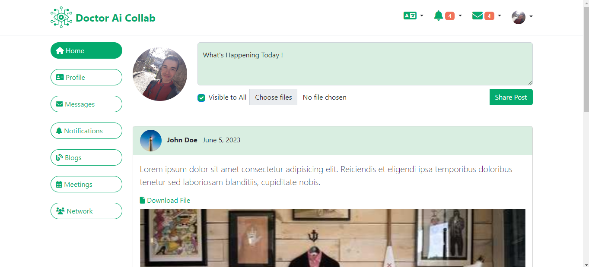
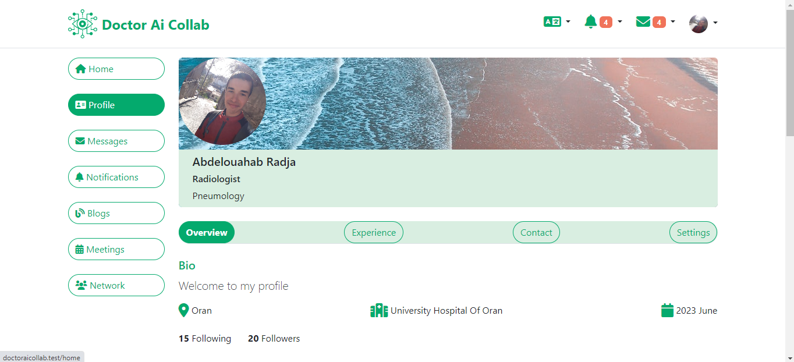
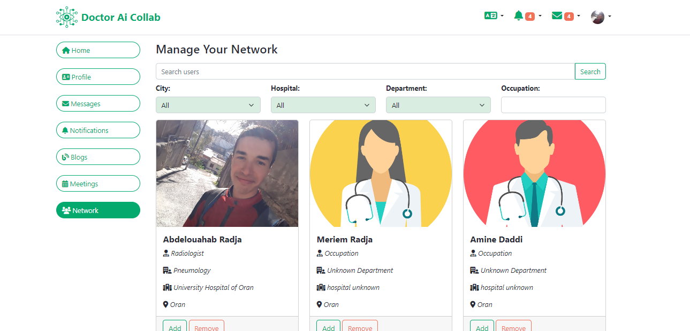
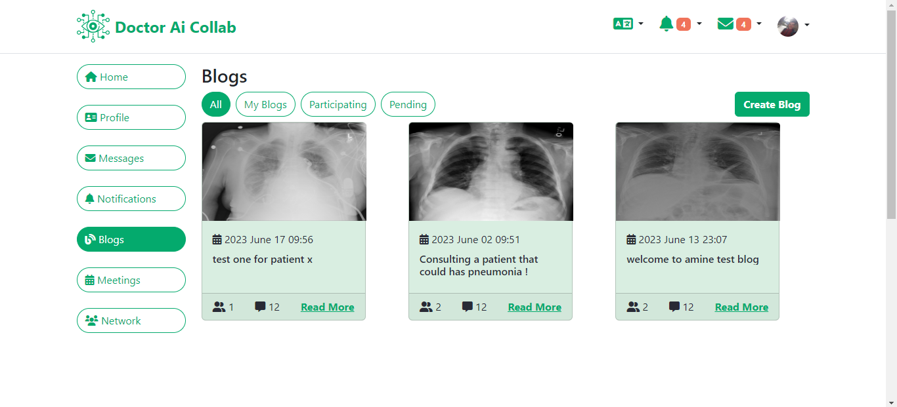
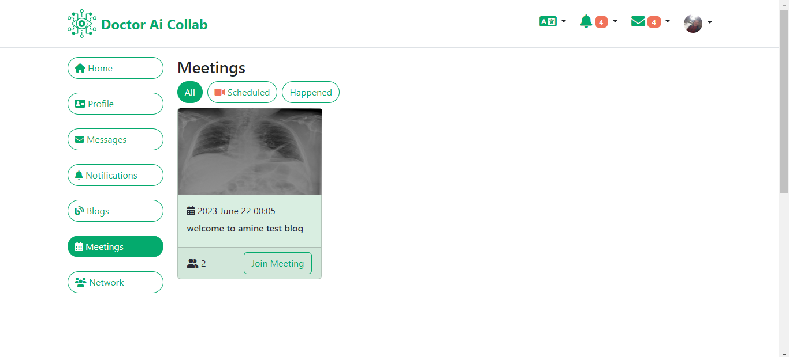
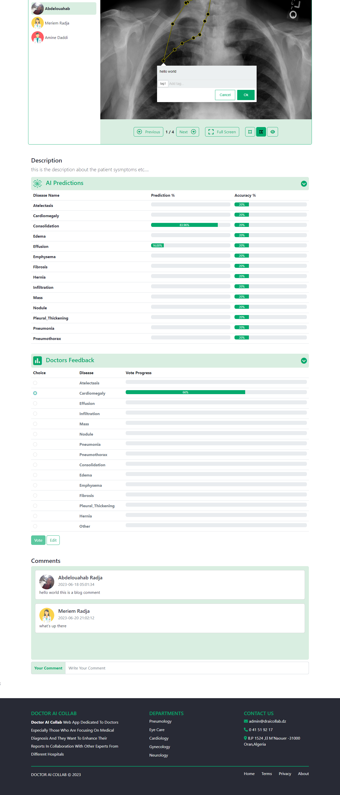

# Laravel First App: **Doctor AI Collab**

## **About**

This is my first laravel web-app for diagnosing x-ray medical images dedicated to novice doctors which makes them able to solve a diagnostic problem in a collaborative way.
In addition to that they can read AI predictions for each image which helps them to recognize which disease the patient has.

**Notes**

> In this web-app I used a deployed deep learning model on flask to fetch predictions for x-ray images on the web-app.

> Due to my hardware limits I got a bad accuracy when I trained the model, but at least I could connect the deployed model with the web-app

> Since I used a dataset of pneumorax diseases, then doctors of penumology field can use it, as well as others can use it normal

**Check the link of deployed model** [Flask-App Github Repo](https://github.com/whbb98/flask-firstApp)

---
## **What can a doctor do ?**
* Create an acount then login
* Browse available blogs, scheduled meetings
* Find other users (name, city, occupation, hospital)
* Edit personal profile 
* **Create a Blog** (diagnosis problem)
    * title
    * description
    * invite participants (doctors)
    * schedule a meeting (**external link**)
    * upload images (chast x-ray images)
* **Inside the blog**
    * Navigate the images slider
    * Annotate each Image (add notes, tags)
    * Watch other doctors annotations
    * Watch AI Predictions for the current image on the slider
    * Vote on the most probable disease (14 pulmonary disease)
    * Comment to other doctors
---
## **Development Environment**

**Frontend**
- Html
- Css
- Js
- JQuery
- Bootstrap 5
- [Annotorious](https://annotorious.github.io/) (for image annotations)

**Backend**

- Laravel 10 including (Elequent ORM, Blade)
- php v8.1
- Mysql database

## **Web-app Limts (not implemented yet)**
* Realtime Notifications
* (Friendship) Follow/Unfollow
* Messaging other users

## **Future Work**
* Improve the DL model accuracy
* Add another DL model for image annotations

> The database file is included in "/README/**database_design.mwb**" which you can create it in your local pc using mysql workbensh (Forward Engineering).

> Thanks for reading

## **Screenshots**
**Home**

**Profile**

**Network**

**Blogs**

**Meetings**

**Blog**
